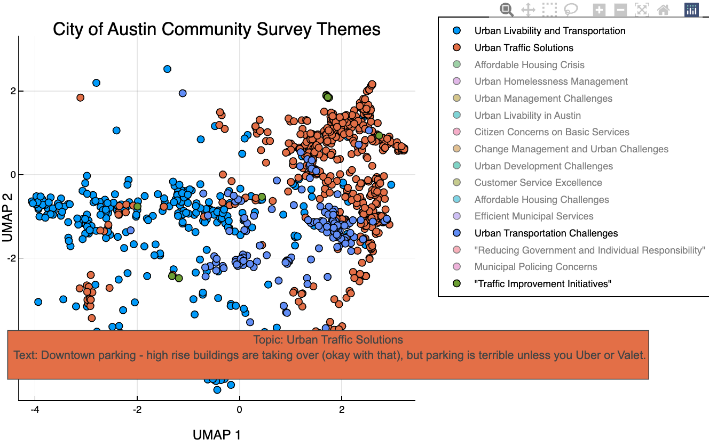

# LLMTextAnalysis.jl: "Unveil Text Insights with LLMs" 
[](https://svilupp.github.io/LLMTextAnalysis.jl/stable/) [](https://svilupp.github.io/LLMTextAnalysis.jl/dev/) [](https://github.com/svilupp/LLMTextAnalysis.jl/actions/workflows/CI.yml?query=branch%3Amain) [](https://codecov.io/gh/svilupp/LLMTextAnalysis.jl) [](https://github.com/JuliaTesting/Aqua.jl)


## Introduction
LLMTextAnalysis.jl is a Julia package crafted to harness the power of Large Language Models (LLMs) for effectively identifying and labeling topics within document corpora. It offers an efficient way to analyze textual data, providing insights into underlying themes and concepts.

### Quick Start
Jump right into LLMTextAnalysis.jl with this simple example:

Note: You need to have a working LLM setup to run this example. See [PromptingTools.jl](https://github.com/svilupp/PromptingTools.jl). It takes a maximum of two minutes to get the OpenAI API key.

```julia
using LLMTextAnalysis
texts = ["I like fries","I like burgers","How do you cook chicken?", "Recently, I read a fantasy novel about dragons"] # some vector of documents
index = build_index(texts)
```

You'll see the following output:

```plaintext
[ Info: Embedding 4 documents...
[ Info: Done embedding. Total cost: $0.0
[ Info: Computing pairwise distances...
[ Info: Extracting keywords...

DocIndex(Documents: 4, PlotData: None, Topic Levels: 2)
```

Now, you can use the `build_clusters!` function to add some topic clusters:
```julia
build_clusters!(index; k=2) # if you don't choose k, it will be chosen automatically
# review the topics generated when we ask for 2 clusters
index.topic_levels[2]
```

```plaintext
[ Info: Building hierarchical clusters...
[ Info: Cutting clusters at k=2...
[ Info: Done building 2 topics. Cost: $0.0

2-element Vector{TopicMetadata}:
 TopicMetadata(ID: 1/2, Documents: 3, Label: "Food Preferences and Cooking Techniques",  Summary: -)
 TopicMetadata(ID: 2/2, Documents: 1, Label: "Dragons in Fantasy Novels",  Summary: -)
```

Or you can just call the `plot` function (it will create some topic clusters automatically under the hood):
```julia
using Plots
plot(index)
```

For some visual examples, scroll down to the [Basic Usage](#basic-usage) section.

### Installation and Setup
Install LLMTextAnalysis.jl via a direct link (it's not yet registered).

```julia
using Pkg
Pkg.add("https://github.com/svilupp/LLMTextAnalysis.jl")
```
 
The package depends on PromptingTools.jl, which facilitates integration with various Large Language Models. We recommend OpenAI for its efficiency, cost-effectiveness, and privacy. See [PromptingTools.jl documentation](https://github.com/svilupp/PromptingTools.jl) for setup details.

### Basic Usage
Start analyzing your document corpus with these steps:

1. Load your documents into the package.
2. Use the `build_index` function to process your texts.
3. Use the `plot` function to visualize the results. It will call all the supporting functions under the hood.

A good starting point is the City of Austin Community Survey, available [here](https://data.austintexas.gov/dataset/Community-Survey/s2py-ceb7/data).

```julia
using Downloads, CSV, DataFrames
using Plots
using LLMTextAnalysis
plotlyjs() # recommended backend for interactivity, install with `using Pkg; Pkg.add("PlotlyJS")`

## Load the data
df = CSV.read(joinpath(@__DIR__, "cityofaustin.csv"), DataFrame);
col = "Q25 - If there was one thing you could share with the Mayor regarding the City of Austin (any comment, suggestion, etc.), what would it be?"
docs = df[!, col] |> skipmissing |> collect;

## Explore the topics in just 2 lines of code
index = build_index(docs)
pl = plot(index; title = "City of Austin Community Survey Themes")
```




Run the full example via `examples/1_topics_in_city_of_austin_community_survey.jl`.

### Advanced Features and Best Practices
This section covers more advanced use cases and best practices for optimal results.

- Serialize your index to the disk (once the topics are fitted)! Saves money and time when you need to restart the REPL session.
- If you dislike the INFO logs, set `verbose=false`.
- Start by "zooming out" to get a sense of the overall themes (set `k=4`), then "zoom in" to explore the sub-themes (eg, set `k=20`)
- Leverage the plot interactivity (`PlotlyJS` backend will display the actual texts and topic labels on hover).
- For diverse datasets like survey questions (eg, DataFrame with many columns), create a separate index for each open-ended question for easy comparison / switching back and forth.
- For large documents, use `split_by_length` from PromptingTools.jl to split them into smaller chunks and explore the sub-themes.
- The package is designed for tens of thousands of documents, typically processed within minutes. For hundreds of thousands of documents, please await future versions with enhanced efficiency features.

### Core Concepts
LLMTextAnalysis.jl revolves around the `DocIndex` struct, which stores document chunks, embeddings, and related data. Document embeddings are pivotal, capturing the semantic essence of text chunks. LLMs are then employed to categorize and label the emerging themes.

### FAQs and Troubleshooting
For answers to common questions and troubleshooting advice, please refer to the FAQ section in the docs or open an issue.
It also includes some directions for future development.

### Inspirations and Acknowledgements
The development of LLMTextAnalysis.jl drew inspiration from tools like [lilac](https://www.lilacml.com/), [Nomic Atlas](https://atlas.nomic.ai/), and the work of Linus Lee (see the [presentation at AI Engineer Summit 2023](https://www.youtube.com/watch?v=YvobVu1l7GI)).

### Similar Packages
- [TextAnalysis.jl](https://github.com/JuliaText/TextAnalysis.jl) is a comprehensive package for text processing and analysis, offering functionalities like tokenization, stemming, sentiment analysis, and topic modeling. Unlike LLMTextAnalysis.jl, TextAnalysis.jl provides a broader range of traditional NLP tools suitable for various text analysis tasks.
- [TextModels.jl](https://github.com/JuliaText/TextModels.jl) enhances the TextAnalysis package with practical natural language models, typically based on neural networks (in Flux.jl)
- [Transformers.jl](https://github.com/chengchingwen/Transformers.jl) provides access to the HuggingFace Transformers library, which offers a wide range of pre-trained state-of-the-art models for NLP tasks. It also allows users to build transformer-based models from scratch on top Flux.jl.
- [StringAnalysis.jl](https://github.com/zgornel/StringAnalysis.jl) is a fork of TextAnalytics.jl, which offers a similar set of functionalities as TextAnalysis.jl, but with a slightly different API. It extends the original package with additional features like dimensionality reduction, semantic analysis, and more.